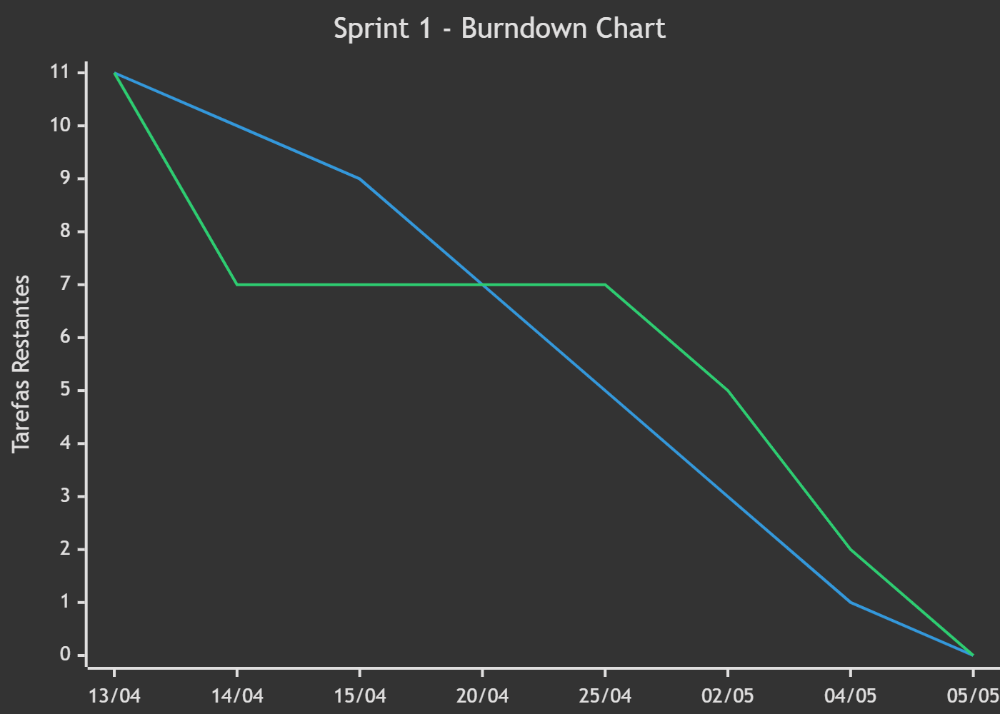

# SOCCER INSPECTOR
Repositório do projeto integrador do 5° semestre do curso de Desenvolvimento de Software Multiplataforma

<h1>DESCRIÇÃO:</h1>    
Soccer Inspector é um software de análise de desempenho físico de atletas que compõem o plantel de um time de futebol, com base no histórico de registro de atividade dos jogadores ao longo de partidas com o objetivo de identificar perfis de jogadores e seus desempenhos.

#Tecnologias Utilizadas

Mobile

  

Frontend Web

  

Backend & API

  

Banco de Dados

  

Inteligência Artificial

  

Ferramentas e DevOps

  

# 🗂️ SPRINTS
| Sprint | Data de Início | Data de Entrega | Status  |
|--------|----------------|-----------------|---------|
|  1     | :calendar: ➡ (13/04/2026) | 📆 ➡ (30/04/2026) |  Encerrado |
|  2     | :calendar: ➡ (04/05/2026) | 📆 ➡ (21/05/2026) |  Em Andamento |
|  3     | :calendar: ➡ (25/05/2026) | 📆 ➡ (11/06/2026) |  Em Andamento |

---

#Detalhamento das Sprints

## Sprint 1 — Planejamento e Estruturação do Projeto

### ✅ O que foi desenvolvido

- Configuração inicial do ambiente Flutter
- Criação e organização do repositório no GitHub
- Configuração do GitHub Projects
- Definição do padrão de branches
- Desenvolvimento dos wireframes da aplicação
- Criação do protótipo navegável no Figma
- Definição da identidade visual inicial
- Validação do fluxo do usuário
- Modelagem relacional do banco de dados
- Desenvolvimento dos scripts SQL
- Criação do diagrama de componentes

## ⚠️ Desafios encontrados

- Definição da arquitetura inicial do sistema
- Organização das responsabilidades da equipe
- Ajustes no fluxo de navegação da aplicação
- Estruturação inicial do banco de dados
- Padronização do versionamento Git

## 🛠️ Tecnologias utilizadas

  

---

##  Sprint 2 — Desenvolvimento das Funcionalidades

## 🔄 Em desenvolvimento
- CRUD de jogadores
- Desenvolvimento da API principal
- Desenvolvimento da API de IA
- Integração com PostgreSQL
- Integração entre API e IA
- Criação dos endpoints
- Análise exploratória dos dados (EDA)
- Desenvolvimento do modelo de rede neural
- Feature Engineering
- Implementação de gráficos e dashboards
- Desenvolvimento das telas funcionais
- Exportação do modelo de IA
- Testes unitários backend
- Testes de interface Flutter
- Testes dos endpoints
- Configuração do GitHub Actions
- Estruturação de documentação da API
- Configuração da comunicação entre serviços

## ⚠️ Desafios atuais

- Integração entre IA e backend
- Performance das consultas
- Padronização da comunicação API ↔ Mobile
- Ajustes no treinamento do modelo

## 🛠️ Tecnologias utilizadas

  

---

## 🚀 Sprint 3 (DATA)
### O que foi feito:
-

### Problemas encontrados durante a Sprint 1:
- 

### Tecnologias usadas:
- 

---

# BURNDOWN SP1
 

 
 

-----------------------------------------------------------------------------------

# BURNDOWN SP2
 

 
 

-----------------------------------------------------------------------------------

# BURNDOWN SP3
 

 
 

-----------------------------------------------------------------------------------

# 🔗 LINKS

### 🧮 BACKLOG DO PRODUTO 
[Clique Aqui](https://github.com/HighTechDSM/ABP_5_DSM/issues)

### 📖 REQUISITOS DO CLIENTE
[Clique Aqui]()

### 🎨 FIGMA
[Clique Aqui](https://www.figma.com/design/bd0lFd0Tk7shoq7ah2BCfa/Untitled?node-id=0-1&t=dRorqfMjBMjTMjgO-1)

### Jupiter
[Clique Aqui]()

# :computer: EQUIPE

|CARGO | NOME| SOCIAL MEDIA |
|------|-----|:--------------:|
| P.O (Product Owner) |   André Ventura   |     |
| P.O (Scrum Master) |   André Michel   |     |
| P.O (Developer) |   Bruno Henrique   |     |
| P.O (Developer) |   Edlaine Souza   |     |
| P.O (Developer) |   Eduardo Henrique  |     |
| P.O (Developer) |   Luana Pinheiro  |     |
| P.O (Developer) |   Rodrigo de Andrade   |     |
