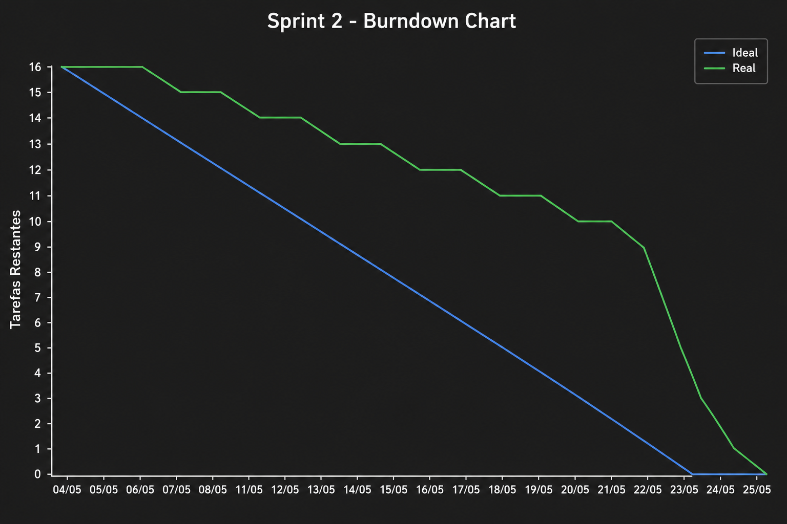

# SOCCER INSPECTOR

<p align="center">
  
</p>

<p align="center">
  Sistema inteligente para análise de desempenho de atletas de futebol utilizando Inteligência Artificial, dashboards analíticos e monitoramento de indicadores físicos.
</p>

# SOBRE O PROJETO

O **Soccer Inspector** é uma plataforma desenvolvida para auxiliar analistas de desempenho, preparadores físicos e comissões técnicas na avaliação de atletas de futebol.
A solução permite importar dados históricos de partidas, analisar indicadores físicos dos jogadores, identificar perfis semelhantes através de Inteligência Artificial, detectar quedas de desempenho e disponibilizar dashboards para acompanhamento dos resultados.

O sistema é composto por:

- Dashboard Web para análise e gerenciamento
- Aplicativo Mobile para consulta dos dados
- API Backend responsável pelas regras de negócio
- Banco de Dados PostgreSQL
- Módulo de Inteligência Artificial para análise dos atletas
  


---

# TECNOLOGIAS UTILIZADAS

### Frontend web
<p>
  
</p>

### Bibliotecas
- React
- TypeScript
- Vite
- TailwindCSS
- TanStack Router
- TanStack Query
- Recharts
- Shadcn/UI
- Radix UI

---

### Backend
<p>
  
</p>

### Bibliotecas
- Express
- JWT
- BCrypt
- PostgreSQL
- CORS

---

### Inteligência Artificial
<p>
  
</p>

### Bibliotecas
- Python
- TensorFlow
- Pandas
- NumPy
- Scikit-Learn

---

### Mobile
<p>
  
</p>

### Bibliotecas
- Flutter
- Dart
- Provider
- HTTP
- Flutter Secure Storage

---

### Banco de Dados
<p>
  
</p>

---

### Ferramentas
<p>
  
</p>

---

# ESTRUTURA DO PROJETO

```text
ABP_5_DSM
│
├── init.sql
│
├── assets
│
└── soccer_inspector_app
    │
    ├── backend
    │   ├── src
    │   ├── package.json
    │   └── tsconfig.json
    │
    ├── flutter
    │   ├── lib
    │   ├── android
    │   ├── ios
    │   └── pubspec.yaml
    │
    ├── src
    │
    ├── package.json
    └── vite.config.ts
```
---

# COMO EXECUTAR PROJETO

## Pré-requisitos
- Node.js 20+
- PostgreSQL 15+
- Flutter SDK 3+
- Git

---

## Banco de Dados

Crie o banco PostgreSQL e execute o script:
```sql
init.sql
```
---

## Backend

Acesse a pasta:

```bash
cd soccer_inspector_app/backend
```
Instale as dependências:
```bash
npm install
```
Execute em desenvolvimento:
```bash
npm run dev
```
Build de produção:
```bash
npm run build
```
Executar versão compilada:
```bash
npm start
```

---

## Frontend Web

Acesse a pasta:

```bash
cd soccer_inspector_app
```
Instale as dependências:
```bash
npm install
```
Execute:
```bash
npm run dev
```
Build:
```bash
npm run build
```
Preview:
```bash
npm run preview
```

---

## Aplicativo Mobile

Acesse:

```bash
cd soccer_inspector_app/flutter
```
Instale as dependências:
```bash
flutter pub get
```
Executar Android:
```bash
flutter run
```
Executar Web:
```bash
flutter run -d chrome
```
Gerar APK:
```bash
flutter build apk
```
---

#ENDPOINTS DA API

## Autenticação

Base URL:
```http
/api/auth
```

| Método | Endpoint | Descrição |
|----------|----------|------------|
| POST | /register | Cadastro de usuário |
| POST | /login | Autenticação |
| GET | /profile | Dados do usuário autenticado |

---

## Jogadores

Base URL:
```http
/api/jogadores
```

| Método | Endpoint |
|----------|----------|
| GET | / |
| GET | /estatisticas |
| GET | /id/:id |
| GET | /grupo/:grupo |
| GET | /rendimento/:rendimento |
| GET | /perfil/:perfil |
| GET | /:athlete |

---

## Dashboard

Base URL:
```http
/api/dashboard
```

| Método | Endpoint |
|----------|----------|
| GET | /stats |
| GET | /analise/:grupo |

---

## Perfis

Base URL:
```http
/api/perfis
```

| Método | Endpoint |
|----------|----------|
| GET | /posicoes |
| GET | /substitutos |
| GET | /:athlete |

---

# PRODUCT BACKLOG

|ID   | Requisitos | Prioridade |
|-----|------------|------------|
|RF01 |	Importar dados históricos de partidas para o banco de dados	| Alta |
|RF02 |	Permitir importação de novos dados de desempenho	| Alta |
|RF03	| Identificar perfis de jogadores através de IA	| Alta |
|RF04	| Comparar atletas com base em indicadores de desempenho	| Média |
|RF05	| Detectar quedas de desempenho | Alta |
|RF06	| Emitir alertas para a comissão técnica	| Média |
|RF07	| Exibir dashboards e gráficos analíticos	| Alta |
|RF08	| Disponibilizar acesso via dispositivos móveis	| Alta |

---

# USER STORIES

### US01 – Importação de Dados
Como analista de desempenho, quero importar dados históricos dos jogadores para realizar análises e identificar padrões.

### US02 – Comparação de Jogadores
Como preparador físico, quero comparar jogadores com características semelhantes,
para que eu possa definir treinamentos individualizados.

### US03 – Detecção de Queda de Desempenho
Como membro da comissão técnica, quero receber alertas quando um atleta apresentar queda de desempenho,
para agir preventivamente.

### US04 – Visualização de Indicadores
Como analista, quero visualizar dashboards e gráficos,
para interpretar os dados rapidamente.

### US05 – Acesso Mobile
Como treinador, quero acessar as análises pelo celular,
para acompanhar os atletas em qualquer lugar.

---

# DEFINITION OF DONE

Uma atividade será considerada concluída quando:

- Código implementado
- Revisão realizada por outro integrante
- Commit enviado para o repositório
- Build executada sem erros
- Testes executados
- Issue encerrada
- Documentação atualizada
- Integração validada

---

# SPRINTS

| Sprint | Data de Início | Data de Entrega | Status  |
|--------|----------------|-----------------|---------|
|  1     | (13/04/2026) | (30/04/2026) |  Encerrado |
|  2     | (04/05/2026) | (21/05/2026) |  Encerrado |
|  3     | (25/05/2026) | (16/06/2026) |  Encerrado |

---

# SPRINT BACKLOG
|Issue | Atividade | Responsável | Status | Requisito |
|------|-----------|-------------|------------|-----------|
| #35	 | Autenticação JWT |	Luana Pinheiro | Entregue |	RNF02 |
| #36	 | Validação de Entrada |	Luana Pinheiro | Entregue |	RNF02 |
| #34	 | Criptografia de Dados | Luana Pinheiro | Entregue | RNF02 |
| #33	 | Requisições HTTPS | Luana Pinheiro | Entregue |RNF02 |
| #16	 | CRUD Jogadores |	Luana Pinheiro | Entregue | RF01 |
| #17	 | Endpoint de Importação de Dados | Bruno Henrique	| Entregue | RF02 |
| #18	 | Endpoint de Consulta de Desempenho |	Bruno Henrique | Entregue |	RF05 |
| #27  | Exportação do Modelo Treinado | Bruno Henrique | Entregue | RF03 |
| #28	 | Criação da API da IA | Bruno Henrique | Entregue |	RF03 |
| #37  | Ajustes de Layout | Rodrigo & Edlaine | Entregue | RF01 |
| #39	 | Testes de Usabilidade | Rodirgo & Edlaine | Entregue | RNF01 |
| #40  | Correção de Bugs | Equipe | Entregue | RNF04 |
| #38	 | Testes Integrados | André Ventura | Entregue | RNF04 |
| #41	 | Deploy Backend |	André Michel | Entregue | RP02 |
| #42	 | Deploy Banco de Dados |	André Michel | Entregue | RP02 |
| #43	 | Deploy IA | André Michel | Entregue | RP02 |
| #44	 | Build APK Flutter |	André Michel | Entregue | RF08 |

---

# RESUMO DAS SPRINTS

## Sprint 1 — Planejamento e Estruturação do Projeto

### O que foi desenvolvido

- Levantamento dos requisitos do sistema
- Construção do Product Backlog
- Criação das User Stories
- Definição da arquitetura inicial da solução
- Modelagem do banco de dados PostgreSQL
- Desenvolvimento dos wireframes
- Construção do protótipo navegável no Figma
- Organização do repositório GitHub
- Definição do fluxo de trabalho da equipe
- Planejamento das próximas sprints

### Desafios encontrados

- Definir a arquitetura do sistema
- Estruturar a comunicação entre os módulos
- Modelar os dados dos atletas
- Organizar as responsabilidades da equipe

### Tecnologias utilizadas

- Figma
- PostgreSQL
- Git
- GitHub
- Flutter (estrutura inicial)
- Dart
- VS Code

---

##  Sprint 2 — Desenvolvimento das Funcionalidades

### O que foi desenvolvido

- Desenvolvimento do Dashboard Web
- Desenvolvimento das telas do aplicativo Flutter
- Criação da API Backend em Node.js
- Implementação dos primeiros endpoints
- Integração com PostgreSQL
- Estruturação do módulo de Inteligência Artificial
- Análise exploratória dos dados (EDA)
- Treinamento inicial da rede neural
- Desenvolvimento dos dashboards analíticos
- Implementação das consultas de dados
- Estruturação da documentação técnica

### Desafios encontrados

- Integração entre Backend e IA
- Padronização das APIs
- Tratamento dos dados para treinamento
- Performance das consultas ao banco

### Tecnologias utilizadas

- React
- TypeScript
- Node.js
- Express
- PostgreSQL
- Python
- TensorFlow
- Flutter
- Dart
- Git
- GitHub

---

## Sprint 3 — Integração, Segurança e Deploy

### O que foi desenvolvido

- Autenticação JWT
- Criptografia de dados
- Validação de entrada
- Configuração HTTPS
- CRUD completo de jogadores
- API de IA
- Exportação do modelo treinado
- Endpoint de consulta de desempenho
- Endpoint de importação de dados
- Integração IA ↔ Backend
- Ajustes de layout
- Correção de bugs
- Melhorias de usabilidade
- Testes integrados
- Testes de usabilidade
- Validação dos endpoints
- Deploy do Backend
- Deploy do Banco de Dados
- Deploy da IA
- Geração do APK Android

### Desafios encontrados

- Garantir segurança da aplicação
- Estabilizar a comunicação entre serviços
- Integrar IA, Backend e Frontend
- Validar a aplicação em ambiente de produção
- Garantir confiabilidade dos testes

### Tecnologias utilizadas

- React
- TypeScript
- Node.js
- Express
- PostgreSQL
- Python
- TensorFlow
- Flutter
- Dart
- JWT
- BCrypt
- Git
- GitHub

---

# BURNDOWN SP1
 <div align = center>
 
 </div>

-----------------------------------------------------------------------------------

# BURNDOWN SP2
 <div align = center>
 
 </div>

-----------------------------------------------------------------------------------

# BURNDOWN SP3
 <div align = center>
 
 </div>

---

# 🔗 LINKS

### BACKLOG DO PRODUTO 
[Clique Aqui](https://github.com/orgs/HighTechDSM/projects/2)


### Prototipo do aplicativo
[Clique Aqui](https://www.figma.com/design/bd0lFd0Tk7shoq7ah2BCfa/Untitled?node-id=0-1&t=dRorqfMjBMjTMjgO-1)


### Prototipo da IA
[Clique Aqui](https://colab.research.google.com/drive/1vNiqZ1nualDeYq6lT-kyqGMy6WJxspPS?usp=sharing)

---

# :computer: EQUIPE

|CARGO | NOME| SOCIAL MEDIA |
|------|-----|:--------------:|
| P.O (Product Owner) |   André Ventura   |     <a target="_blank" href="https://github.com/AndreHVentura"></a>|
| S.M (Scrum Master) |   André Michel   |     <a target="_blank" href="https://github.com/andremc331"></a>|
| DEV. (Developer) |   Bruno Henrique   |     <a target="_blank" href="https://github.com/BrunoHenrique258"></a>|
| DEV. (Developer) |   Edlaine Souza   |     <a target="_blank" href="https://github.com/edlaine-souza"></a>|
| DEV. (Developer) |   Eduardo Henrique  |     <a target="_blank" href="https://github.com/EduardoBrito2"></a>|
| DEV. (Developer) |   Luana Pinheiro  |     <a target="_blank" href="https://github.com/Luana873"></a>|
| DEV. (Developer) |   Rodrigo de Andrade   |     <a target="_blank" href="https://github.com/RodrigodeAndrade90"></a>|
